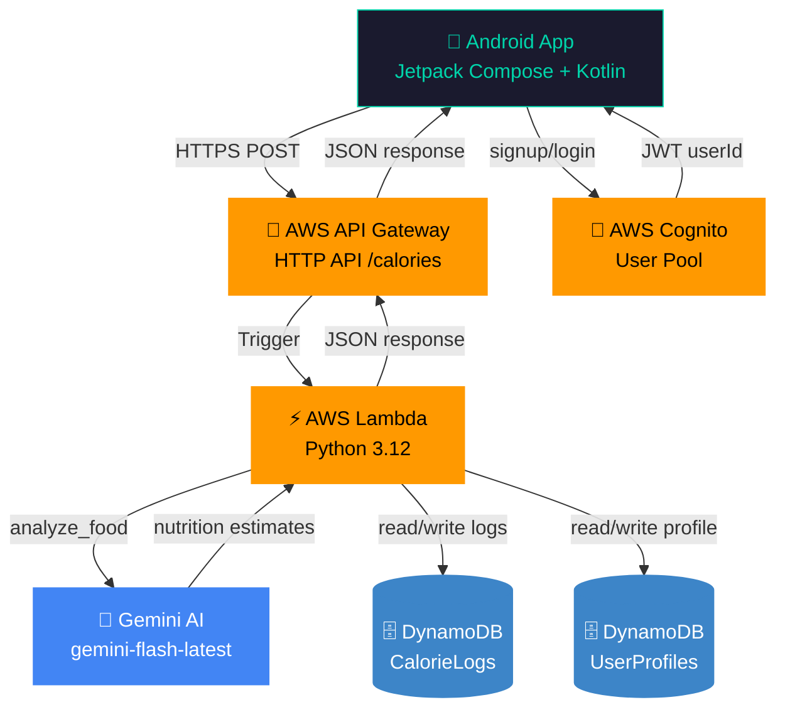

```mermaid
flowchart TD
    A["📱 Android App\nJetpack Compose + Kotlin"] -->|HTTPS POST| B["🔀 AWS API Gateway\nHTTP API /calories"]
    B -->|Trigger| C["⚡ AWS Lambda\nPython 3.12"]
    C -->|analyze_food| D["🤖 Gemini AI\ngemini-flash-latest"]
    C -->|read/write logs| E[("🗄️ DynamoDB\nCalorieLogs")]
    C -->|read/write profile| F[("🗄️ DynamoDB\nUserProfiles")]
    A -->|signup/login| G["🔐 AWS Cognito\nUser Pool"]
    G -->|JWT userId| A
    D -->|nutrition estimates| C
    C -->|JSON response| B
    B -->|JSON response| A

    style A fill:#1a1a2e,color:#00D4AA,stroke:#00D4AA
    style B fill:#FF9900,color:#000,stroke:#FF9900
    style C fill:#FF9900,color:#000,stroke:#FF9900
    style D fill:#4285F4,color:#fff,stroke:#4285F4
    style E fill:#3d85c8,color:#fff,stroke:#3d85c8
    style F fill:#3d85c8,color:#fff,stroke:#3d85c8
    style G fill:#FF9900,color:#000,stroke:#FF9900
```
